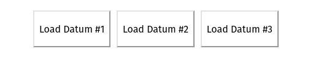
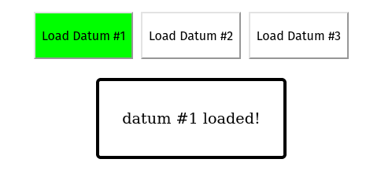
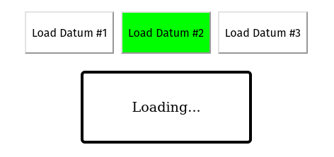

# Demo of a common `fetch()` race condition

## Installation

Clone the repo and `cd` into the directory:
```console
$ git clone git@github.com:MattyMay/fetch-race-condition.git
$ cd fetch-race-condition
```

Install the demo with the provided `install` script:
```console
$ ./bin/install
```

## Run the demo

Use the provided `run` script to start a development server:
```console
$ ./bin/run
```

Navigate to `localhost:8000` in your browser. You should see three buttons:




When you click a button, a request will be made to the server. The URL of the request is `/data/<datumid>/`. When we get a response, we expect to see the datum loaded:



## Expose the race condition

The server route to return a datum is configured to respond slowly when datum #2 is requested. Click "Load Datum #2" and you should see a loading state for several seconds before seeing the datum displayed:



Once the datum is displayed, try clicking the button again but this time click one of the other buttons before the datum is displayed. What you should see is the new datum get displayed, but then after several seconds the displayed datum should switch back to datum #2! This is because after clicking another button to load a different datum, there was still an outstanding request for datum #2, and once the response finally arrives the function that updates the UI for datum #2 runs. This is incorrect behavior, because the user expects that a different datum be displayed after pressing the other button.

## Fix the race condition
In `demo/js/main.jsx`, alter the `Demo` component towards the bottom of the return statement to render a `DataDisplayFixed` component instead of `DataDisplay`. The `run` script you used earlier will watch for changes in javascript files, so the results of this change will be reflected in your browser after saving the file and reloading the page. Try the same thing you did before, and notice how the late response for datum #2 no longer overwrites the newly fetched datum in the UI.
